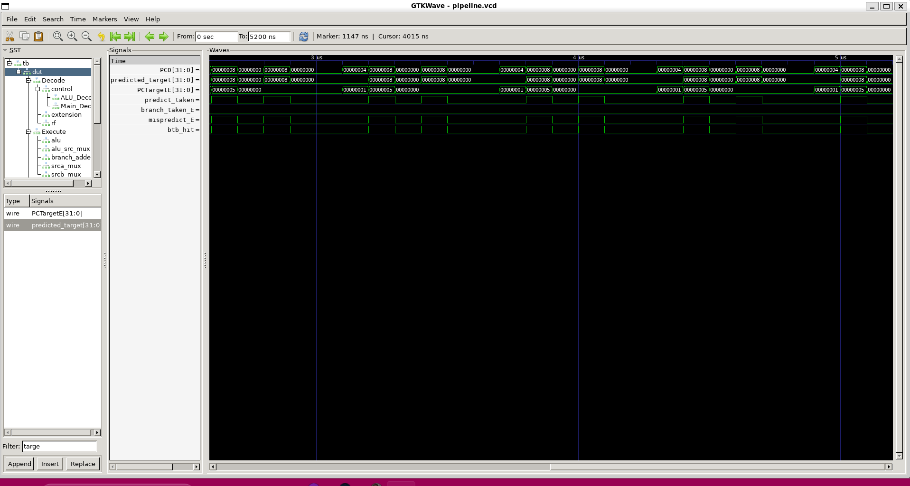
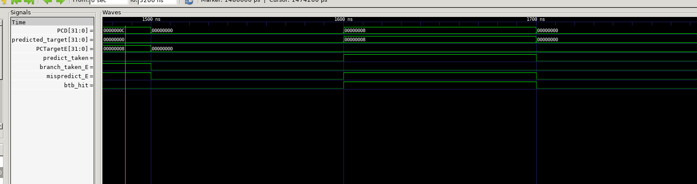
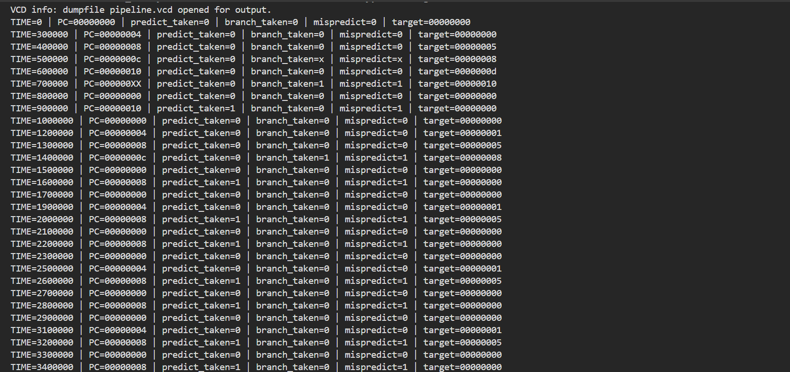

````markdown
# RISC-V Processor Design and Branch Prediction

A collection of computer architecture projects focused on RISC-V processor design, branch prediction, and instruction-level simulation. This repository includes:

- A 5-stage pipelined RISC-V processor in Verilog
- A BTB-based dynamic branch predictor implementation
- A simple RISC-V assembler
- Branch prediction accuracy analysis using instruction traces

---

# Repository Structure

```text
CS204_Project/
│
├── RISCV/                  # Pipelined RISC-V processor
├── Branch_Prediction/      # Branch prediction trace analysis
├── organised/              # Supporting files / experiments
├── images/                 # GTKWave screenshots and outputs
└── README.md
````

---

# 5-Stage Pipelined RISC-V Processor

Implemented a modular 5-stage pipelined RISC-V processor in Verilog with:

* Instruction Fetch (IF)
* Instruction Decode (ID)
* Execute (EX)
* Memory Access (MEM)
* Writeback (WB)

## Features

* Pipeline forwarding / hazard handling
* ALU and control unit implementation
* Register file and instruction memory
* Pipeline registers between stages
* GTKWave-based verification

---

# Branch Prediction Extension

Extended the processor with a dynamic branch prediction unit consisting of:

* Branch Target Buffer (BTB)
* 2-bit saturating counter predictor
* Speculative fetch logic
* Branch misprediction recovery
* Pipeline flush handling

The predictor performs speculative control flow redirection during the fetch stage and updates predictor state during execute-stage branch resolution.

---

# Branch Predictor Architecture

## Branch Target Buffer (BTB)

The BTB stores:

* Branch PC tags
* Predicted target addresses
* Predictor state bits

## 2-bit Saturating Counter

Each BTB entry contains a 2-bit dynamic predictor:

| State | Meaning            |
| ----- | ------------------ |
| 00    | Strongly Not Taken |
| 01    | Weakly Not Taken   |
| 10    | Weakly Taken       |
| 11    | Strongly Taken     |

---

# Waveform Verification

Functionality was verified using:

* Icarus Verilog
* GTKWave

## Speculative Fetch and BTB Prediction



The waveform demonstrates:

* BTB hit detection
* Predicted target generation
* Speculative next-PC selection

---

## Branch Misprediction Recovery



The waveform demonstrates:

* Branch resolution in execute stage
* Misprediction detection
* Pipeline recovery and PC redirection

---

## Simulation Output



Console traces showing:

* predictor state transitions
* speculative execution behavior
* repeated branch execution patterns

---

# Running the Processor

## Compile

```bash
iverilog -o pipeline_out pipeline_tb.v
```

## Run Simulation

```bash
vvp pipeline_out
```

## Open GTKWave

```bash
gtkwave pipeline.vcd
```

---

# RISC-V Assembler

This repository also includes a simple RISC-V assembler capable of:

* Parsing assembly instructions
* Generating machine code
* Producing hexadecimal memory initialization files

Used for generating test programs for the processor pipeline and branch predictor verification.

---

# Branch Prediction Accuracy Analysis

The `Branch_Prediction/` directory contains experiments analyzing branch predictor accuracy using execution traces.

Implemented and evaluated:

* Static prediction
* 1-bit predictors
* 2-bit saturating predictors

Metrics include:

* Prediction accuracy
* Misprediction rate
* Trace-driven behavior analysis

---

# Tools Used

* Verilog HDL
* Icarus Verilog
* GTKWave
* RISC-V ISA
* Git/GitHub

---

# Key Learning Outcomes

* Pipeline design and hazard handling
* Dynamic branch prediction
* Speculative execution
* Control hazard recovery
* Trace-driven microarchitecture analysis
* Hardware verification using waveform simulation

---
---

# Credits

The base 5-stage pipelined RISC-V processor framework was adapted from the MERL-DSU educational processor design repository. Significant extensions and modifications were implemented, including:

- BTB-based dynamic branch prediction
- 2-bit saturating counter predictor
- Speculative fetch logic
- Branch misprediction recovery and pipeline flushing
- GTKWave-based verification infrastructure
- Additional branch prediction analysis and tooling

Original educational framework copyright:
MERL-DSU (Apache License 2.0)


